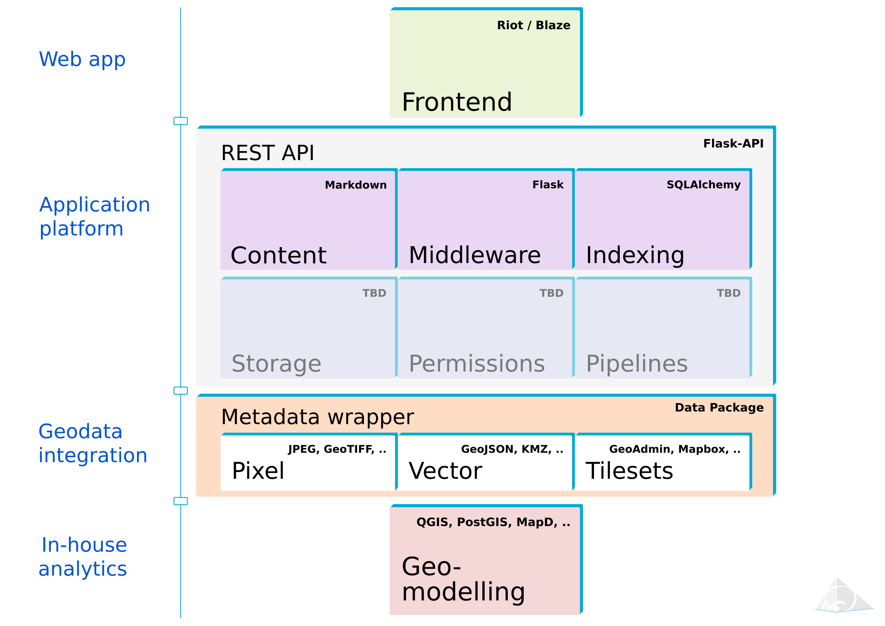
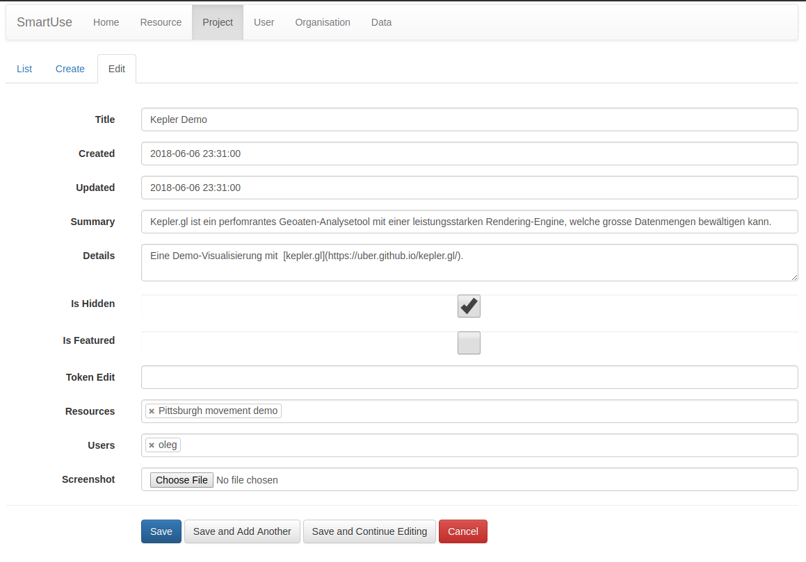
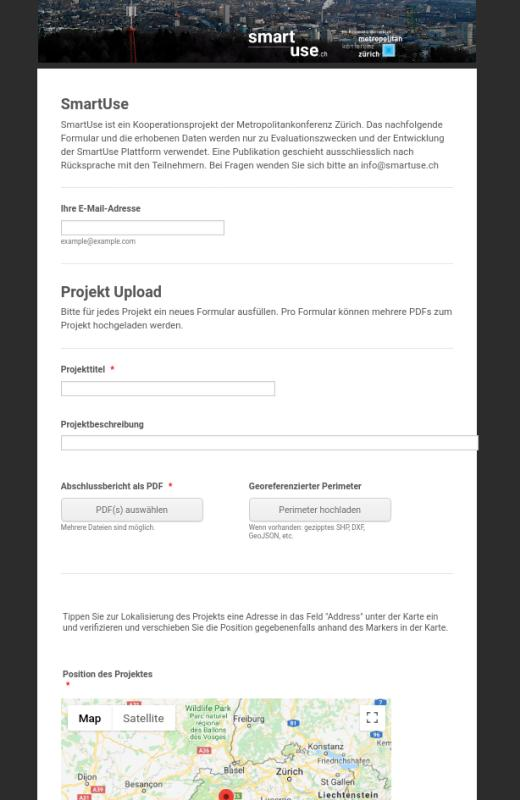
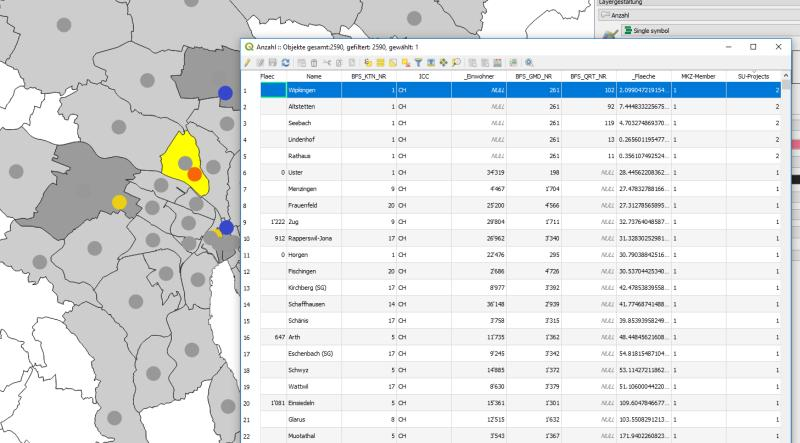
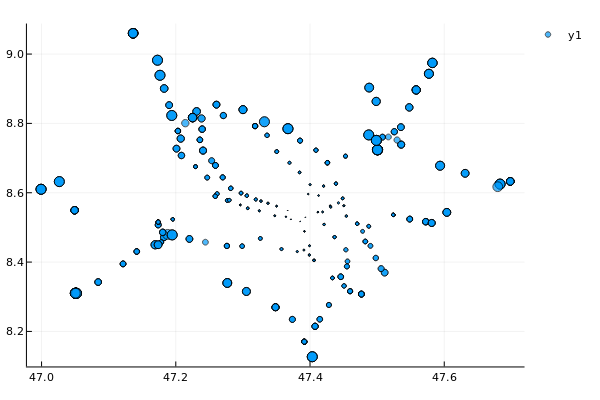
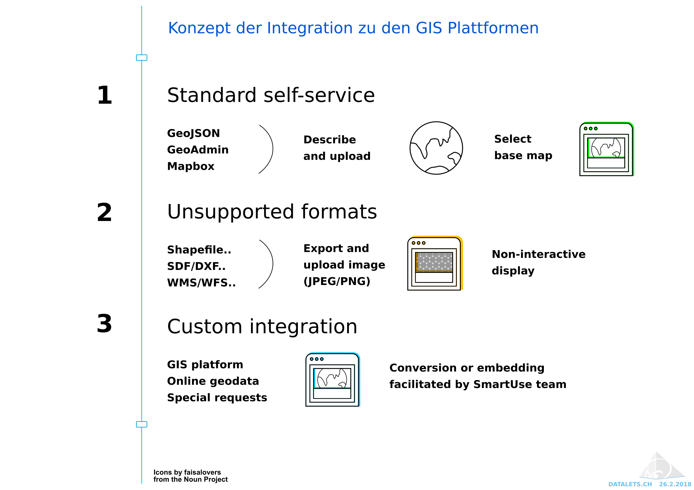

**Smart Use** is a prototype platform for sharing geographical and other data models about urban development in a usable and accessible way, with our primary users the 100+ communes in the 2M area around Zürich, architects and planning offices, and the various stakeholders involved in evidence-based decision making, civic dialogue and questions of governance. It offers a new basis for developing digital participation models through a freely accessible planning platform for Swiss metropolitan areas.
Smart Use enables collection, analytics and visualisation of data useful for an effidence-based city planning. It aims at a proactive and collaborative exploitation of all openly available data for the benefit of the citizens. It helps to involve interested individuals and organisations into the process of solving urgent spatial development, city planning, big data and governance challenges by enabling them to share their data, their analytics, the resulting findings, their knowledge and their requests and concerns.


# Executive summary

The Zurich Metropolitan Area Association promotes the quality of life and strengthens the Zurich Metropolitan Area as a nationally and internationally outstanding business location. It offers a platform for the exchange of information between cantons and municipalities, implements projects and advocates the concerns of the Zurich Metropolitan Area at federal level.

From 2016 to 2019, the association is pursuing a priority programme in which, among other things, concrete solutions for the current challenge of "the consequences of population and economic growth" are to be worked out. In February 2017, the association called for the submission of cooperation projects in a two-stage procedure.

The SmartUse ARGE ("Arbeitsgemeinschaft") submitted the **Smart Use** project in the first round in April 2017. Aiming to contribute to a more evidence-based approach to spatial development by investigating and mapping spatial use patterns "bottom-up" through the analysis of suitable relational data sets, the project proposed to achieve this by: (1) recording spatial-temporal routines and presenting, analysing and interpreting them at different scale levels, and (2) involving the actors involved in spatial development with a view to existing spatial structures, planned projects and strategic guidelines. In July 2017, the ARGE association awarded the contract for the initial project, to run until January 2019.

The aims of the initial project founded by Zurich Metropolitan Area Association included:

- development of a robust data structure that allows for action-relevant analyses and interpretations;
- establishment of a network of knowledge bearers who are active in the private sector, administration and science;
- creating a network of data providers, in cooperation with members of the association, to put evidence-based spatial development on a sustainable basis.

# Introduction

This document is a summary of the technical areas regarding data aggregation, analysis and publication that have been investigated during the Alpha phase, addressing the following areas:

1. [Design process](#design-process)
1. [Engineering standards](#engineering-standards)
1. [Software architecture](#software-architecture)
1. [Application development](#application-development)
1. [Frontend development](#frontend-development)
1. [Onboarding process](#onboarding-process)
1. [Map services](#map-services)
1. [Geodata interfaces](#geodata-interfaces)
1. [Data pipelines](#data-pipelines)
1. [Online infrastructure](#online-infrastructure)
1. [Industry partners](#industry-partners)
1. [Open data](#open-data)
1. [Open source](#open-source)

## Design process

As a project, **Smart Use** began with a series of design thinking sprints where various user objectives were formulated. A [Trello](https://trello.com) project board to write and assign user stories in the [Kanban style](https://medium.com/@danielb0hn/design-kanban-a-freeform-kanban-system-for-creative-teams-a17350089de5) (as shown below) has been used. Each card contains a user story, describes a potential audience, and Trello's assignment/due date/labels are used to keep track of status.


Sketches were draw up corresponding to proposals around the main features and interests, then presented and further refined in a series of workshops (treated as short-term focus groups) by the design team. Some of the resulting wireframes can be found in the `mockups` folder.

<!--@Oleg TODO: Add more wireframes-->


At alpha stage, the design process did not include the use of expressed methods of design thinking facilitation, A/B testing or focus groups, that would be standard to a user experience engineering practice. We also briefly evaluated, but did not decide on, the use of a user experience/user interface framework such as [Material Design](https://material.io/). Nonetheless, we agreed that this would be the desired approach in the upcoming extension of **Smart Use**.

## Engineering standards

From a technical perspective, it was important to us that **Smart Use** adopts metaphors and components from leading practitioners in the open data field. We presented and discussed early on in the project the central open data portals of the Swiss federal government, [opendata.swiss](https://opendata.swiss), and that of the City of Zürich, [data.stadt-zuerich.ch](https://data.stadt-zuerich.ch) - and evaluated the [CKAN software](https://ckan.org) that they both implement.

An early test involved installation of CKAN and evaluation of its [geospatial capabilities](https://docs.ckan.org/en/ckan-1.7.4/geospatial.html), which can be complemented by the rich open-source ecosystem behind the [PostGIS project](https://postgis.net/). CKAN has been in development for over 10 years and runs thousands of portals around the world, being the current standard fo open government data. It represents the recommended basis for a mature/ production-ready software deployment for a project like **Smart Use**.

Nevertheless, we chose to use a newer technology stack for the project, in order to evaluate leading-edge approaches to the technical requirements - and potentially make valuable contributions back to the community. In this light, our project aims for integration with next-generation open data portals, such as the new [datahub.io](https://datahub.io) site, while retaining compatibility with current platforms like CKAN. It implements the emerging and upcoming standards of frictionless data.

The **Smart Use** portal is based on the emerging [Frictionless Data Standards](https://frictionlessdata.io/specs/) for metadata exchange, in the development of which our tech lead has [been involved](https://frictionlessdata.io/articles/oleg-lavrovsky/). For an introduction, visit the [Field Guide](https://frictionlessdata.io/field-guide/) or watch this introductory video (1:15)

[](https://www.youtube.com/watch?v=R_wCov5VVv8)

The main advantages of using Frictionless Data are:

- data packages: a containerization format for any kind of data to enable simple data publication, transport, and consumption.
- platform agnostic interoperability of these data packages with various existing tools
- cutting costs by the provided interoperability and the easier, i.e. frictionless, integration of data packages into various platforms

As Smart Use is exploiting frictionless data package formats, it is automatically compliant with a huge set of existing data manipulation and verification tools, i.e. data quality can be tested and assured without the need of implementing new tools.

## Software architecture

The initial architecture of the project had to quickly evolve through several development phases. The only constant was the web-facing user interface. It was not a priority for the alpha release to have role-based security or highly scalable implementation: these will be the goals of future phases as the project becomes operational.

Our first internal release was a static page built with JavaScript libraries, which was later rebuilt using a nodejs server and the [Express](https://expressjs.com/) framework to serve `GeoJSON` files from a `git` repository. Although this approach can work remarkably well in some circumstances, we briefly switched to a MongoDB database with [geospatial queries](https://docs.mongodb.com/manual/geospatial-queries/) before rewriting the project with the [Flask microframework](http://flask.pocoo.org/) for Python as detailed in the next section. This includes migration to PostgreSQL due to better support for indexing as well as integration with PostGIS.

The main areas of our architecture include interfaces between the geo-modelling process being done by our analyst team, and the application platform - through an interface that allows creation, editing and storage of metadata for comprehensive publication of pixel, vector and tileset-based geodata.

Our application services are based on the [Representational State Transfer (REST)](https://en.wikipedia.org/wiki/Representational_state_transfer) architectural style, wrapping application microservices inside of consistently documented interfaces.

We are cognizant of parallel projects, such as [Limmatstadt 3D](http://metropolitanraum-zuerich.ch/themen/kooperationsprogramm/digitales-3d-stadtmodell-limmatstadt.html) also supported by the Zurich Metropolitan Area Association - or even third party developers, open data users, and so on, that may wish to access our platform APIs.

The frontend can be, therefore, completely decoupled, and built in any choice of frameworks or technologies. For the **Smart Use** beta platform, we used a lightweight reactive framework that demonstrated this approach.



*(above) A visual summary of the components and technologies involved*

## Application development

The current beta release of **Smart Use** is built with the [Flask microframework](http://flask.pocoo.org/) for Python, a mature and widely implemented basis for Web applications - including large sites like Pinterest and LinkedIn.

Working with the highly performant and scalable [Postgres](https://www.postgresql.org/) open source database, we have implemented our geodata-relevant models using the [GeoAlchemy 2](https://geoalchemy-2.readthedocs.io/en/latest/) extensions for [SQLAlchemy](https://www.sqlalchemy.org/) to work with [PostGIS](http://postgis.net/). This allows our Object-Relational Model (ORM) to contain geographic references such as coordinates and shapes, and to perform geographic searches such as bounding boxes on the data.

The [Flask Admin](https://flask-admin.readthedocs.io) library was used to create a responsive administration interface based on the SQLAlchemy ORM and [Bootstrap templates](https://getbootstrap.com/). This allows rapidly adapting the model, and the usage of [Alembic](http://alembic.zzzcomputing.com/) via [Flask Migrate](https://flask-migrate.readthedocs.io/) to safely upgrade the database schema between releases.



*(above) Screenshot of the administrative interface*

To implement our REST-compliant architecture, we used [Flask API](https://www.flaskapi.org/), which generates multi-format routes and Web accessible views of our API similar to [Django REST](http://www.django-rest-framework.org/) for developers to use.

To allow publication of stories with rich text descriptions, we support [Markdown formatting](https://en.wikipedia.org/wiki/Markdown) through the [Python-Markdown](https://python-markdown.github.io/) library, which converts content to escaped HTML inside of the API response.

We have tested a number of file storage providers, and have settled on [Amazon S3](https://aws.amazon.com/s3/) as the preferred cloud service going forward. Files are currently directly hosted on the application server filesystem, but as a next extensions, we plan to use Amazon S3 buckets for storage.

In the future, this project could potentially move completely to another framework, e.g. [Django](https://www.djangoproject.com/). Continuing to build upon our architectural foundation and working through requirements gathering and team-building phases to determine how the platform will be supported long term will be key to making the right decisions here.

Compared to Flask, Django offers a deep integration with relational database management systems such as PostgreSQL. It provides better support for an agile development process, requiring frequent changes in the database model. Although Flask is a great option for a quick web application, in particular as a web frontend for a python script, it lacks proper support and clean integration of data migrations. Nevertheless, Flask offers database integation with low effort when using third party libraries such as SQLAlchemy. But if relational databases comes into full play together with an agile development process, the effort maintaining migrations etc. with Flash massively increases. Here, Django plays its role from the beginning. It offers a comprehensive support of "data model"-based  applications backed with a relational database by its mighty ORM (object-relational-mapping). It provides a deep integration with most relational database management systems such as e.g. PostgreSQL.

## Frontend development

**Smart Use** offers a first basic frontend for discovery of the projects and resources in **Smart Use**, which aims at at rapid development and exploration of interface development techniques. The user experience that we wanted to initially evoke in the platform is through the use of "storymapping", a design approach effectively practiced by [KnightLab](https://storymap.knightlab.com/), [Swisstopo](https://www.geo.admin.ch/en/thematic-geoportals-federal-offices/storymaps-telling-stories-with-geodata.html), [ESRI](https://storymaps.arcgis.com/en/) and in data journalism.

Our initial frontend is built on a basic grid framework with generic design elements. The frontend is based on HTML5 responsive web standards, implemented in the [Riot.js](https://riot.js.org/) reactive framework, with components from the [Blaze UI](https://www.blazeui.com) toolkit.


*(above) Screenshot of the project alpha*

## Onboarding process

The steps in becoming a publisher on an open data platform such as **Smart Use** are supposed to be very simple - a quick sign-up with automated confirmation and post-publication moderation - or involved - including SMS/post or even person-to-person confirmation, protracted consultation and support models. Our goal with this project was to aim for a balanced approach.

In the current phase of the project, the onboarding is limited to a small group of partners closely involved in the development, and involves careful coordination through e-mail, Trello and GitLab. Nevertheless, we tried to put in some of the steps of a more lightweight and scalable process in the future.



Primary to this is an online form - as in the screenshot above. It is made with [JotForm](https://www.jotform.com/), chosen after trialing several providers - and allows users to specify the kind of project that they wish to publish.

The form includes basic contact details as well as geographic reference points and a file upload functionality. Data collected from this form is currently transferred to our backend application by hand, but should be automated in the future.

In the administration, a user account can be created and assigned to an organization, where details of the authorship of the publication can be defined. Projects are created for individual case studies, which can have unique or shared Resources - which are containers for geodata, and representative of "chapters" in the storymap.

As noted above, either [Markdown](https://www.markdowntutorial.com/) or HTML can be used in rich-text publications on the platform, and currently our team facilitates the process of transferring content out of Word or PDF documents. In the future, a rich text editor or some instruction in Markdown would be part of the onboarding process.

More crucially, adoption of our geodata interfaces will enable the bulk of the work of preparing publications to be transferred to our users. Although tools like Mapbox Studio can be quite intuitive for some, the use of tutorials and wizard-interfaces will enable smoother and faster data integration in future releases. See [Communes Map](https://gitlab.com/SmartUse/smartuse-platform/wikis/GIS/communes-map-process) in our wiki for an example workflow for current publication on the platform.

We believe that desktop tools have not completely lost their appeal in the day of pervasive mobile apps, and have looked into the possibility of developing a [QGIS plugin](https://docs.qgis.org/testing/en/docs/pyqgis_developer_cookbook/), or even a mobile app for uploading data. Much of the process is simply format conversion and aesthetic refinement, so an effort in frontend development should pay off in user confidence. As would, of course, secure integration with more 3rd party geodata management platforms.


*(above) Summary of the steps involved in a future on-boarding process*

## Map services

The creation of interactive visualizations is a repeatable process, involving data collection, data processing and exploration via desktop- or web-based tools, and publication of the final visualizations in online and offline formats. See the next section for details of the "geodata interface" - what we call the glue between these steps.

To address the publication challenge, we tested and compared ten [mapping platforms](https://gitlab.com/SmartUse/smartuse-platform/wikis/Tech/Map-service-evaluation). Some of the platforms require considerable investment into infrastructure, or have high hosting costs. We started by narrowing down the list to four for our integration testing:

[Mapbox GL](https://www.mapbox.com/mapbox-gl-js) is a suite of open-source libraries for embedding highly customizable and responsive client-side maps. Based on this, GeoJSON data resources are rendered natively in our beta application / platform, with optional customization of presentation features such as marker shapes and line colors.

[Mapbox Studio](https://www.mapbox.com/) allows anyone to create beautiful and flexibly designed custom maps without requiring much experience with GIS, and embed them into any website. While this is a commercial, paid service, there is also a free/open source desktop tool called [Mapbox Studio Classic](https://github.com/mapbox/mapbox-studio-classic) available. We support this as an enhanced alternative to plain GeoJSON rendering with Mapbox GL.

[OpenLayers](http://openlayers.org/) can display map tiles, vector data and markers loaded from any source, and is made for enabling the use of geographic information of all kinds. It is completely free and Open Source. We have primarily tested integration of OpenLayers through the [GeoAdmin](http://api.geo.admin.ch/) service of the Swiss federal government. It is possible to create maps with custom data loaded via WMTS or KMZ, and embed them into our platform.

[Kepler.gl](http://kepler.gl/) is a "data-agnostic, high-performance web-based application for visual exploration of large-scale geolocation data sets..[that] can render millions of points representing thousands of trips and perform spatial aggregations on the fly". This is a new open source tool from the ride-sharing company Uber that has been enthusiastically received by the geodata community. We have run a few tests to determine the feasibility of implementing this platform, and while the initial results are impressive, more work needs to be done to enable full support.

All of the other mapping platforms that we considered are potential candidates for integration on **Smart Use**, as long as a short list of criteria - such as secure embedding, mobile user interface, open formats, reliability, ease of use - can be met.

## Geodata interfaces

Geodata analytics in the current beta release were done using the open source [QGIS software](https://www.qgis.org/en/site/) in conjunction with [PostGIS server](https://postgis.net/). [R scripts](https://www.r-project.org/) and [Julia notebooks](https://julialang.org/) were also used for some data science tasks.

Several geodata workflows around these tools have been explored during the project. Our primary interface between these environments has been the [GeoJSON format](http://geojson.org/). In the project wiki you can find documentation of our main process in the [Communes Map](https://gitlab.com/SmartUse/smartuse-platform/wikis/GIS/communes-map-process) - transforming geopoints collected from Smart Use Projects into a heatmap for the project front page.



*(above) Screenshot from the [Communes Map](https://gitlab.com/SmartUse/smartuse-platform/wikis/GIS/communes-map-process) workflow.*

Other approaches included [Use Clusters](https://gitlab.com/SmartUse/smartuse-platform/wikis/GIS/use-clusters) - a workflow to extract clusters of uses out of from-to relationships; and [Distance Matrix](https://gitlab.com/SmartUse/smartuse-platform/wikis/GIS/distance-matrix) - a process to generate a distance matrix to calculate real distances and travel times in for a grid.

The Distance Matrix implemented in [R using the Google Distance Matrix API](notebooks/02-google distance matrix/DistanceMatrix.Rmd), and in [Julia using ZVV timetables](notebooks/01-traveltimes/README), can be found along with deployment notes in the `notebooks` folder.



*(above) Screenshot from the [Julia distance matrix](notebooks/01-traveltimes/README)*

Future work in this area would involve further evaluation and implementation of support for more geodata sharing platforms, such as [GeoServer](http://geoserver.org/), [Boundless Server](https://boundlessgeo.com/boundless-server/) and [MapD](https://www.mapd.com/).

## Data pipelines

We have been working on a data science environment to support analytical work, with the goal of building scalable geodata ingest & processing pipelines into the project from an early stage. Our aim is to develop an accessible, usable, highly performant platform which works with new Web map data providers like [Mapbox](https://www.mapbox.com/) or [Uber Movement](https://movement.uber.com), as well as established sources such as [WMTS services](https://en.wikipedia.org/wiki/Web_Map_Tile_Service).

During the project we have been actively interested in the entire [Frictionless Data](https://frictionlessdata.io/) initiative, and in particular the use of [Data Package Pipelines](https://github.com/frictionlessdata/datapackage-pipelines) to automate the analytical process described above. We are one of the first experimental users of the [geospatial data package](https://frictionlessdata.io/docs/publish-geo/#geo-data-packages) early-release specification, which we use to annotate our metadata with specifications relevant to publication on the site.

Our beta API understands the Data Package format to import internally or externally hosted data resources, and exports data in a compatible schema - with the intent that API consumers such as the demo frontend are oriented towards use of interoperable Data Package standards as well.

A sample response from our API:

```json
{
    "resources": [
        {
            "mediatype": "application/vnd.geo+json",
            "title": "Statistical Trends",
            "name": "smartuse-resource-10",
            "id": 10,
            "path": "SmartUse/demo_3/datapackage.json",
            "description": "<p>GeoJSON loading via Data Package</p>"
        }
    ],
    "data": {
        "date-created": "2018-04-06",
        "date-updated": "2018-04-06",
        "title": "Gemeinden auf Smart Use",
        "summary": "Projekte geolokalisiert",
        "path": "http://alpha.smartuse.ch/api/project/5",
        "featured": false,
        "name": "smartuse-5",
        "id": 5,
        "hidden": true,
        "text": "Gemeinden auf Smart Use"
    },
    "details": "Lorem Ipsum",
    "author": {
        "fullname": "Thorben Westerhuys",
        "username": "thorben",
        "id": 3,
        "organisation": {
            "logo": "https://metropolitanraum-zuerich.ch/files/Metro/images/MKZ_Logo.svg",
            "name": "SmartUse ARGE",
            "id": 1,
            "url": "http://smartuse.ch"
        },
        "gravatar": "https://www.gravatar.com/avatar/8334dd5429cd3963a28cfc502ec1df40?s=80"
    }
}
```

Compatibility with these standards allows the usage of the full [Frictionless Data toolbox](https://frictionlessdata.io/software/) to work incrementally on changes to the data model, while conserving reproducibility and transparency at every step.

Our recommendation is to continue embracing the standards we have evaluated in the beta, to partner with [Datopian](https://datopian.com/) - the team behind much of the groundbreaking work in this area - for technical consultation, and ensure that **Smart Use** is a contributing member of the nascent Frictionless Data ecosystem.

In order to guarantee compliance with Frictionless data standards, **Smart Use** has invited Rufus Pollock, the founder of Datopian and former developer of CKAN, for a brief consultancy and compliance check. The data package implemented in **Smart Use** is fully compliant with the standards of Frictionless Data and actively contributes to the set of standards in the area of geo-located data sets.


*(above) Conceptual schematic of our data integration strategy*

## Online infrastructure

Besides running several development instances, **Smart Use** runs it production beta on standard, up-to-date, secure and high-performance virtual machines running Linux in the cloud. In addition, **Smart Use** has developed a (currently offline) data science environment to support analytical work.

During the course of the project we considered hosting from [Amazon](https://aws.amazon.com), [Heroku](https://heroku.com) and several Swiss-based cloud providers. The project beta platform is hosted with [Linode](https://www.linode.com/), a global leader in virtualization hosting, and provider of virtual machine services across global regions: USA, Singapore, Tokyo and two datacenters in the EU. Our beta server is running in the EU-Central cloud located in Frankfurt, Germany.

To achieve our longer-term aim is to develop an accessible, usable, highly performant platform which works with leading Web map data providers, several considerations need to be made in provisioning enhancements to the currently deployed infrastructure, such as:

- *Server stability*: the maintenance of systems, their administration, updating and load, requires dedicated resources and a scalable platform.
- *Service monitoring*: automated notifications and other mechanisms to be put in place to assure 24/7 reliability of the site.
- *Load balancing and caching*: distributing the processing and caching site contents to increase speed and durability.
- *Security practices*: proactive monitoring and integrity checking to reduce the risk of misuse of the resources is a must today.

**Smart Use** began reaching out to potential technical partners during the project, hiring the Bern-based software development company and innovation agency [89grad](https://89grad.ch) to bring their expert advice on next steps in this area in particular, and on the project in general. 89grad made a code review of the current beta platform and provided the following recommendations for fostering the impact and sustainability of the **Smart Use** platform:

**Code and architecture review:**

- The beta **Smart Use** platform consists of the following main parts:
  - **Backend**: It is a monolithic Flask application using SQLAlchemy and Flask Admin. It is running with up-to-date PostgreSQL and Python 3.
    The backend is concise and coded in an easy to understand way.
  - **Frontend**: It is composed of few libraries such as RiotJS/RiotGear and jQuery/StickyJS. The app code can be easily installed with the YARN package manager.
- The beta **Smart Use** platform represents a good minimum viable product (**MVP**) and can be used for first pilot users. But it requires some substantial changes and adaptions to make it scalable and more sustainable.
- The usage of **Frictionless Data package** standard not only makes a lot of sense for increase and future-proof interoperability, but it brings **Smart Use** to a pioneer role within the open data community. **Smart Use** helps shaping the future of open data resulting in the next level of open data.

**Recommendations**

A few features are essential to make **Smart Use** more stable, easier to maintain and to operate and in the end more usable and, therefore, more attractive to its audience (individuals and organisations in the area of city plannings as well as the citizens themselves):

Extensions and adaptations of visualisations and frontend:

- Listing of projects needs to be improved. The main areas that require improvements are pagination and filtering.
- Inclusion of a proper search engine exploiting the results provided by the backend.

Extensions and improvements of the backend:

- **Role concept:** Adding a role concept is a must in order to implement self-service functionalities for the portal, resulting in reduced costs. An organisation should be able to manage its own users, its own data by itself. But, it should not have any access to other organisations. Currently, the entire user and data management is controlled by a global administration group and, therefore, always requires interactions of the portal owners.
- **Registration and onboarding process** (users): An organisation or an individual should be able to register itself using a proper registration and onboarding process.
- **Modelling of publishing process**: The management of data projects (e.g. uploading new data sets, analytics, etc.) should be modelled and represented with various states, e.g. "data uploaded", "data cleaned", "data verified", "data normalised", "custom analytics run", "data ready for publication waiting approval", "publication approved", "data published". This process needs to be moderated by users with the correct role belonging to the publishing organisation as well as by the maintainer of the **Smart Use** platform.
- **Modelling the data pipeline**: A data pipeline should be modelled in a way that all steps involved in the data amelioration can be automatically and reproducibly applied to the data set fetched from the data source. This includes executing external data processing services as well as storing and executing all scripts (R/Julia) used in order to get the final result.

Further ideas and vision

- Frontend:
  - **Storytelling**: Smart Use could include features for telling a comprehensive story based on the data produced. This might include a timeline or a sequence of data sets and its findings and conclusions.
  - **Definition of data packages** and their components: The frontend could include a way for defining data packages and their components.
  - **Upload functionality** for R/Julia data processing scripts
  - **Create, edit and delete functionality for data pipelines**: A user should be able to create, modify and delete data pipelines for his/her data projects.
- Backend:
  - **Templates for data pipelines**: In order to support organisations and users in the process of data publication, Smart Use should offer templates for standard data pipelines. Templates can be globally available or specific for an organisation.
  - **Versioning of data projects**: Smart Use should support multiple versions of a data project. An organisation should be able to approve a sub set of the available versions of a data project for publication.
  - **Detection of data source updates**: Smart Use should be able to detect updates of a data source. It should automatically fetch the new data and apply all the processing steps of the assigned data pipelines and automatically create a new version. As soon as the processing has been completed, it should inform the owner of the data project about the availability of new results. The new version of the data project including the automatically generated results can then be approved for publication by the data project owner or one of its users with the necessary assigned role. This feature requires role concept, publishing process, data pipelines, and versioning.

89grad implemented and operates a set of web applications with extensive role concept, such as Smart Use will require in the next phase, as well as with various automation and integration requirements for various customers. Examples are:

- Order Gateway and Merchant Portal for e-commerce market place siroop:
  - Handling of updates (master, stock, and price data) for more than 1 Mio products of more than 500 merchants (> 2 Mio updates per day)
  - Handling of all logistic processes, e.g. all orders and returns including integrations wiht various shop systems as well as tracking
  - Portal with a large set of roles for handling orders and logistic processes. Roles include for example merchant users, merchant admins, multi-merchant agency users, multi-merchant agency admins, integration managers, keyaccount managers, and various roles in logistics and customer support
  - Integration of ERP
  - REST API
- Stromer Portal
  - Backend for Stromer connected e-bikes
    - collecting mobility data from e-bikes
    - serving mobility data to e-bike owners or fleet management operators
    - firmware updates for on-bike controllers
    - settings update
    - REST API
  - Merchant Portal
    - firmware and settings update
    - accounting
- Shared economy projects with various customers
  - REST API
  - Management of assets
  - Payment support

## Industry partners

One of the initial aims of the project was to make the platform interesting for potential cooperation with larger organizations, e.g. [Swisscom](https://opendata.swisscom.com/pages/home/) and the [Swiss Post](https://swisspost.opendatasoft.com/explore/?sort=modified), institutions of higher learning, and government. From our initial workshops, such as at [SmartSuisse 2018](https://www.smartsuisse.com/de-CH/programm/ausstellungstag-detail.aspx) (Spatial Planning workshop) and [Geosummit 2018](https://www.geosummit.ch/geosummit-2018/das-wichtigste-ueber-geosummit.html) (Synthetic Populations track), we collected contacts to interested research and industry participants, several of whom had follow-up meetings with us and discussed potential technical cooperation scenarios. **Smart Use** provides a separate document with the contacts to Zurich Metropolitan Area Association.

In order to produce the basis for effective storytelling, we have put together several case studies using open data from project members and partners. It was made clear through the project that many projects with overlaps to **Smart Use** are being developed around the world, with several prominent examples even in Switzerland.

A wholesome strategy in regards to communication and promotion, the legal and technical conditions of partnership, as well as co-development models, have been the subject of much discussion. At the current stage, in the technical area we are aiming for an overall high level of engineering and architectural best practices, industrial standards (Frictionless Data), support for open data licenses, and embracing open source development as detailed below.

## Open data

We aim to be advanced users of [datahub.io](https://datahub.io), [data.stadt-zuerich.ch](https://data.stadt-zuerich.ch), [opendata.swiss](https://opendata.swiss) and other open data portals, especially any based on CKAN or those carrying datasets of [urban development interest](https://opendata.swiss/en/dataset/daten-der-automatischen-fussganger-und-velozahlung-viertelstundenwerte1). We are also aiming to make the platform interesting for potential cooperation with industry partners as described above.

It should be possible to quickly import datasets from portals supporting the [Data Package specification](https://frictionlessdata.io/specs/data-package/) today. Additionally, projects which reference open datasets through Web accessible mapping tools can display them using our embedding tool. Although the [Data Packager extension](https://github.com/frictionlessdata/ckanext-datapackager) enables us to work with CKAN already, we would also like to build in support for the [CKAN API](https://docs.ckan.org/en/latest/api/index.html), in particular to integrate with [geospatial extensions](http://extensions.ckan.org/extension/spatial/).

Even more crucially, **Smart Use** needs to be a provider of Open Data for the project to have relevance and impact in the community. Beginning with the standards-based API, we aim to adhere to various criteria of openness - from encouraging our users to adopt, and clearly publish, [open data licenses](https://opendatacommons.org/licenses/) and guidelines - to ensuring that the raw, machine readable data is accessible through the portal and republishable on other portals - to developing support for Linked Data in the future with a view of integrating with projects like [LINDAS](https://lindas-data.ch/) and [Google Dataset Search](https://toolbox.google.com/datasetsearch/search).

Early involvement of our project team in community events such as the [SRG SSR Hackdays](http://www.hackdays.ch/) and the [Opendata.ch conference](https://opendata.ch/2018), as well as interviews with proponents of open data in Switzerland, have helped us to start to articulate our strategy in ways that may one day benefit the accessibility, transpareny and governance of urban development.

## Open source

Establishing an open source project around the initiative has been an important prerogative of the founding team. We strongly believe that open source development funded through a business model such as [freemium](https://en.wikipedia.org/wiki/Freemium) is the right way to go for this project, and share our intent and experience with stakeholders in the project.

In our [GitLab project](https://gitlab.com/SmartUse/smartuse-platform), we are using leading edge infrastructure for collaboration with a widening team as well as project users, and applying best practices in terms of licenses, documentation, and outreach.

The **Smart Use** beta is built on 100% open source components, and is itself composed and documented in such a way as to promote open source development around it. Nevertheless, additional steps need to be taken before open source can be truly embraced in this project, such as:

- ensuring all stakeholders are on board with the tools and consequences of open source development;
- choosing and enforcing a global licensing model for the project;
- validating the licensing conditions of current and future downstream dependencies;
- setting in place guidelines and standards for moderating and optimizing open source contributions;
- widening the scope of co-development to include more than just code, and embrace open source practices for design, research, and other tasks;
- validate and accelerate the project through open source criteria;
- promote it in the Swiss and international open source community; etc.
