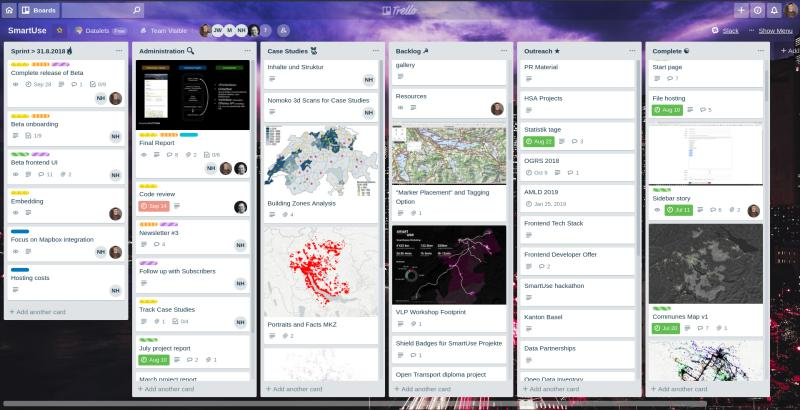
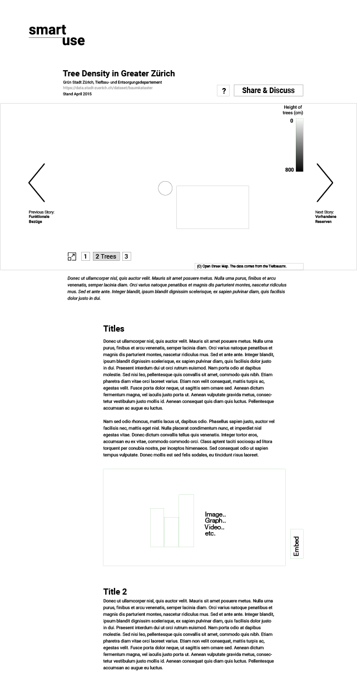
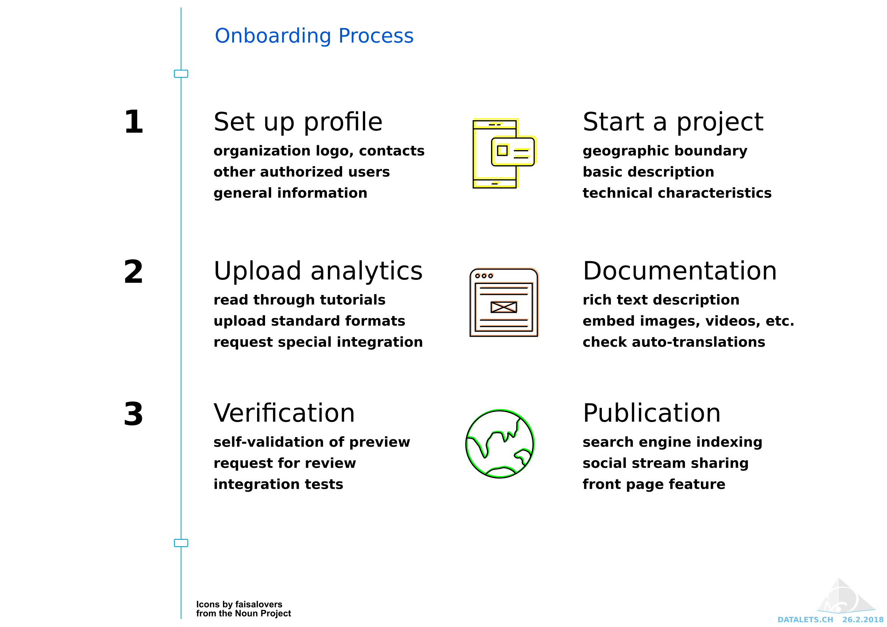

**SmartUse** (working title) is a prototype platform for sharing geographical and other data models about urban development in a usable and accessible way, with our primary users the 100+ communes in the 2M area around Zürich, architects and planning offices, and the various stakeholders involved in evidence-based decision making, civic dialogue and questions of governance. With this project, we propose a new basis for developing digital participation models through a freely accessible planning platform for Swiss metropolitan areas.

*Screenshot of the project alpha*

# Executive summary

The Zurich Metropolitan Area Association promotes the quality of life and strengthens the Zurich Metropolitan Area as a nationally and internationally outstanding business location. It offers a platform for the exchange of information between cantons and municipalities, implements projects and advocates the concerns of the Zurich Metropolitan Area at federal level.

From 2016 to 2019, the association is pursuing a priority programme in which, among other things, concrete solutions for the current challenge of "the consequences of population and economic growth" are to be worked out. In February 2017, the association called for the submission of cooperation projects in a two-stage procedure.

ARGE submitted the **SmartUse** project in the first round in April 2017. Aiming to contribute to a more evidence-based approach to spatial development by investigating and mapping spatial use patterns "bottom-up" through the analysis of suitable relational data sets, the project proposed to achieve this by: (1) recording spatial-temporal routines and presenting, analysing and interpreting them at different scale levels, and (2) involving the actors involved in spatial development with a view to existing spatial structures, planned projects and strategic guidelines. In July 2017, the ARGE association awarded the contract for the initial project, to run until January 2019.

Current aims of the project include:

- development of a robust data structure that allows for action-relevant analyses and interpretations;
- establishment of a network of knowledge bearers who are active in the private sector, administration and science;
- creating a network of data providers, in cooperation with members of the association, to put evidence-based spatial development on a sustainable basis.

# Introduction

This document is a summary of the technical areas regarding data aggregation, analysis and publication that have been investigated during the Alpha phase, addressing the following areas:

1. [Design process](#design-process)
1. [Engineering standards](#engineering-standards)
1. [Software architecture](#software-architecture)
1. [Application development](#application-development)
1. [Frontend development](#frontend-development)
1. [Online infrastructure](#online-infrastructure)
1. [Onboarding process](#onboarding-process)
1. [Geodata interfaces](#geodata-interfaces)
1. [Data pipelines](#data-pipelines)
1. [Industry partners](#industry-partners)
1. [Open data](#open-data)
1. [Open source](#open-source)

## Design process

As a project, **SmartUse** began with a series of design thinking sprints where various user objectives were formulated. We used a [Trello](https://trello.com) project board to write and assign user stories in the [Kanban style](https://medium.com/@danielb0hn/design-kanban-a-freeform-kanban-system-for-creative-teams-a17350089de5), as seen below. Each card contains a user story, describes a potential audience, and Trello's assignment/due date/labels are used to keep track of status.

Sketches were draw up corresponding to proposals around the main features and interests, then presented and further refined in a series of workshops (treated as short-term focus groups) by the design team. Some of the resulting wireframes can be found in the `mockups` folder.

The design process did not at the alpha stage include the use of expressed methods of design thinking facilitation, A/B testing or focus groups, that would be standard to a user experience engineering practice. We also briefly evaluated, but did not decide on, the use of a user experience/user interface framework such as [Material Design](https://material.io/) - nonetheless agreeing that this would be much desired going forward.

## Engineering standards

From a technical standpoint it was important to us that this project adopts metaphors and components from leading practitioners in the open data field. We presented and discussed early on in the project the central open data portals of the Swiss federal government, [opendata.swiss](https://opendata.swiss), and that of the City of Zürich, [data.stadt-zuerich.ch](https://data.stadt-zuerich.ch) - and evaluated the [CKAN software](https://ckan.org) that they both implement.

An early test involved installation of CKAN and evaluation of its [geospatial capabilities](https://docs.ckan.org/en/ckan-1.7.4/geospatial.html), which can be complemented by the rich open-source ecosystem behind the [PostGIS project](https://postgis.net/). CKAN has been in development for over 10 years and runs thousands of portals around the world. This represents the recommended basis for a mature/ production-ready software deployment for a project like **SmartUse**.

Nevertheless, we chose to use a newer technology stack for the project, in order to evaluate leading-edge approaches to the technical requirements - and potentially make valuable contributions back to the community. In this light, our project aims for integration with next-generation open data portals, such as the new [datahub.io](https://datahub.io) site, while retaining compatibility with current platforms like CKAN.

Our alpha application is based on the emerging [Frictionless Data Standards](https://frictionlessdata.io/specs/) for metadata exchange, in the development of which our tech lead has [been involved](https://frictionlessdata.io/articles/oleg-lavrovsky/). For an introduction, visit the [Field Guide](https://frictionlessdata.io/field-guide/) or watch this introductory video (1:15)

## Software architecture

A visual summary of the components and technologies involved:

## Application development

Review and development support of our currently Flask/Python/Postgres based API for the backend of the portal. This could well be Django in a future version. We currently aim to go with Frictionless Data standards and are partnering with Datopian for technical consultation, and would appreciate a second opinion on this as well as our overall architecture detailed below.

We are also cognizant of parallel efforts such as Limmatstadt 3D at Metropolitankonfernez that may access our platform’s APIs.

## Frontend development

We are still at an early stage in regards to designing the user interface to the project. As mentioned above, we briefly investigated but have not settled on a UI system and frontend framework.

A basic frontend is in place for discovery of the projects and resources in **SmartUse**, which aims to prepare the team for more intense exploration of interface development techniques such as "storymapping" in future phases of the project.  

Our initial frontend is built on a basic grid framework with generic design elements. The frontend is based on HTML5 responsive web standards, implemented in [Riot.js](https://riot.js.org/) / [Blaze UI](https://www.blazeui.com).

## Online infrastructure

Currently we are running several development instances, and will need a production deployment towards the end of the year. These need to be standard, up-to-date, secure and high-performance virtual machines running Linux. We are also working on a (currently offline) data science environment to support analytical work. Our larger aim is to develop an accessible, usable, highly performant platform which works with leading Web map data providers like Mapbox Studio or Uber movement. We have done a series of assessments and tested a range of [map service providers](https://gitlab.com/SmartUse/smartuse-platform/wikis/Tech/Map-service-evaluation).

## Onboarding process

Summary of the steps involved in on-boarding users to the platform:

## Geodata interfaces

Our approach to designing the user experience around geodata is through the use of *storymapping*, similar to that practiced by [KnightLab](https://storymap.knightlab.com/), [Swisstopo](https://www.geo.admin.ch/en/thematic-geoportals-federal-offices/storymaps-telling-stories-with-geodata.html) or [ESRI](https://storymaps.arcgis.com/en/).

We are one of the first experimental users of the [geospatial data package](https://frictionlessdata.io/docs/publish-geo/#geo-data-packages) format.

Concept schematic of our data integration strategy:

## Data pipelines

We are working on a data science environment to support analytical work, with the goal of building scalable data ingest & processing pipelines into the project from an early stage.

Currently the analytics are done using the open source [QGIS software](https://www.qgis.org/en/site/) in conjunction with [PostGIS server](https://postgis.net/). Our aim is to develop an accessible, usable, highly performant platform which works with leading Web map data providers like [Mapbox Studio](https://www.mapbox.com/help/studio-manual/) or [Uber movement](https://movement.uber.com). This means we are very intersted in the entire [Frictionless Data toolbox](https://frictionlessdata.io/software/), but especially [Data Package Pipelines](https://github.com/frictionlessdata/datapackage-pipelines) to automate our analytical process.

## Industry partners

We are also aiming to make the platform interesting for potential cooperation with companies like Swisscom and the Swiss Post. We have had some initial workshops on the topic of data sharing, such as at [Geosummit 2018](https://gitlab.com/SmartUse/smartuse-platform/wikis/Texts/geosummit-2018).

## Open data

We aim to be advanced users of datahub.io, data.stadt-zuerich.ch, opendata.swiss and other open data portals, any based on CKAN, and especially those carrying datasets of [urban development interest](https://opendata.swiss/en/dataset/daten-der-automatischen-fussganger-und-velozahlung-viertelstundenwerte1). We are also aiming to make the platform interesting for potential cooperation with industry partners like [Swisscom](https://opendata.swisscom.com/pages/home/) and the [Swiss Post](https://swisspost.opendatasoft.com/explore/?sort=modified). It is possible to quickly import datasets from portals supporting the [Data Package specification](https://frictionlessdata.io/specs/data-package/). Additionally, projects which reference open datasets can optimally display them using our embedding tool.

## Open source

Establishing an open source project around the initiative has been an important prerogative of the founding team. We strongly believe that open source development is the right way to go for this project. Nevertheless, not all stakeholders in the project have a lot of prior experience. With our [GitLab project](https://gitlab.com/SmartUse/smartuse-platform) we are using leading edge infrastructure for collaboration with a widening team as well as project users, and applying best practices in terms of licenses, documentation, and outreach.
